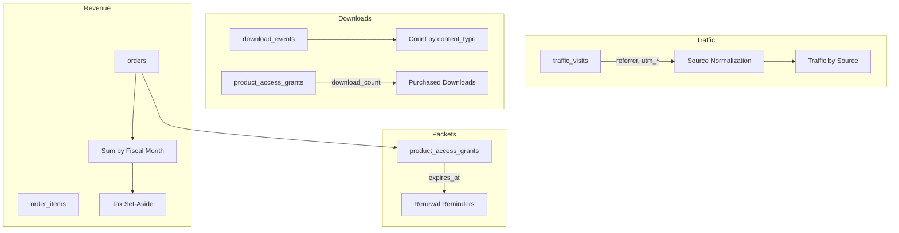

# Admin Dashboard Data Collection & Business Tools Expansion

## Executive Summary

This plan expands the Mile 12 Warrior admin dashboard to support marketing optimization, packet lifecycle management, fiscal planning, customer communication, and download analytics. It includes database schema changes, new API endpoints, dashboard redesign, the New Driver Packet price change, and tax-law research synthesis.

---

## 1. Traffic Analytics Expansion

### Current State

- `[traffic_visits](db/database.js)` stores: `visited_at`, `visitor_key`, `user_id`, `path`
- No referrer or UTM data
- Periods: day, week, month, year; optional YoY
- Stats: unique visitors, return users, logged-in, page views, likely business

### Changes Required

**Database:** Add columns to `traffic_visits`:

- `referrer` (TEXT) — HTTP Referer header (parse domain)
- `utm_source` (TEXT) — e.g., google, facebook, linkedin
- `utm_medium` (TEXT) — e.g., cpc, organic, email
- `utm_campaign` (TEXT) — campaign name

**Server middleware** (`[server.js](server.js)` lines 79–93): Parse `req.get('referer')` and `req.query` (utm_source, utm_medium, utm_campaign) and insert into `traffic_visits`.

**Source normalization:** Map referrer domains to canonical sources:

- `google.com` / `google.co.uk` → Google
- `facebook.com` / `fb.com` / `m.facebook.com` → Facebook
- `linkedin.com` → LinkedIn
- `twitter.com` / `x.com` → X
- `instagram.com` → Instagram
- `bing.com`, `yahoo.com` → Other search
- `(direct)` if no referrer

**Admin Traffic tab** (`[views/admin.html](views/admin.html)`, `[routes/admin.js](routes/admin.js)`):

- Add period options: **Daily** (today), **Weekly** (last 7 days), **Past 30 days**, **Year to date**, **Year over year** (with prior-year comparison)
- Add **Traffic by source** section: pie/bar chart or table of visitors by `referrer`/`utm_source` (aggregated)
- Keep existing unique visitors, page views, return users, YoY growth; add YTD visitors and prior-year YTD for YoY
- Extend `/api/admin/traffic` to return `sources: [{ source, visitors, percent }]` and `ytd`/`priorYtd` when requested

---

## 2. Packet Purchase Tracking & Renewal Reminders

### Current State

- `[product_access_grants](db/database.js)` has `expires_at` for fleet packets (12 months)
- `[course_completions](db/database.js)` stores certificate completions with mailing info
- Fleet packets: `fleet-new-hire-packet`, `fleet-refresher-packet`, `fleet-bundle` — 12‑month license
- No email reminders for expiring licenses or certificate renewals

### Changes Required

**Database:** No new tables required. Use existing `product_access_grants` (`expires_at`), `orders` (`created_at`, `user_id`), `course_completions` (`completed_at`, `mailing`_*).

**New admin tab: “Packets & renewals”**

- Table of packet purchases with: user, product, purchase date, expiry (if applicable), days until expiry
- Filter: expiring within 30/60/90 days; certificates completed (for optional renewal outreach)
- Actions: “Send reminder email” (manual trigger; later can add scheduled job)

**Email reminders:**

- Add `/api/admin/send-renewal-reminder` endpoint (admin-only) that sends a transactional email for a specific grant or completion
- Integrate with existing email capability (if present) or add nodemailer/sendgrid
- Reminder copy: “Your Fleet packet license expires on [date]. Renew to keep access.”

**Course completions:** Already in Completions tab. Add optional “Send renewal reminder” for certificates that have a logical renewal (e.g., annual training); configurable per product type.

---

## 3. Income & Tax Chart (Fiscal Year)

### Fiscal Year

- **End:** April 30 each year
- **First fiscal year:** May 1, 2025 → April 30, 2026 (FY2026)

### Changes Required

**Database:** Optional `fiscal_settings` table or env vars for tax rate and fiscal start/end. For MVP, compute in code.

**New admin tab or Dashboard section: “Revenue & tax”**

- **Income chart:** Product sales by month (or by order date), filtered by fiscal year
- **Tax set-aside:** Configurable rate (e.g., 25–30% for federal + CA self-employment). Running total of `set_aside = revenue × rate`.
- **Fiscal year selector:** FY2026 (May 2025–Apr 2026), FY2027, etc.
- **Running totals:** Total revenue (YTD fiscal), tax set-aside (YTD), net after set-aside

**Data source:** `orders` where `status != 'cancelled'`, `order_items` for per-product breakdown. Sum `total` by `created_at` grouped by month.

**Tax rate:** Admin-configurable (e.g., 25% default). Display disclaimer: “For planning only. Consult a tax professional.”

---

## 4. Tax Law Research Synthesis

### Federal (LLC)

- Pass-through; profits on Schedule C or Form 1065
- Self-employment tax on net earnings
- Estimated quarterly payments (Form 1040-ES)

### California

- **$800 annual franchise tax** (LLC), due 15th of 4th month
- **Income-based fee** if CA income > $250k: $900 ($250–500k), $2,500 ($500k–1M), etc.
- **Digital goods:** Generally exempt from CA sales tax when sold alone (no physical goods)
- **Form 568** (multi-member) or Schedule C on Form 540 (single-member)

### Sacramento (business address)

- Business operations tax if operating in city
- Measure C (2024): minimum ~$50/year for <$100k gross; higher for larger receipts

### Riverside (residence / mail forward)

- Business license if *operating* in Riverside city; residence alone may not trigger
- Nexus: physical presence (Sacramento) vs. where work is performed (internet) — clarify with CPA

### Implementation

- Add a **Tax & compliance** info panel in admin (read-only) with bullet summary and “Verify at fmcsa.dot.gov, ftb.ca.gov, cdtfa.ca.gov” and “Consult a CPA” disclaimer
- Do not auto-calculate tax liability; provide tools for planning only

---

## 5. Address Book (Guest Contacts)

### Requirement

- Keep an address book of site visitors/guests unless they opt out
- Track involvement (page views, downloads, purchases) for marketing and support

### Implementation

**Database:** New table `address_book`:

- `id`, `email`, `name` (optional), `source` (e.g., contact form, checkout, download), `opt_out` (0/1), `created_at`
- Or extend `users` with `opt_out_address_book` and use users + contact_messages as sources

**Simpler approach:** Use existing `users` (registered) + `contact_messages` (guests who emailed). Add `opt_out_address_book` to users; for contact form, store email/name and add “Add to address book (you may opt out anytime)” checkbox — unchecked = opt-in by default.

**Admin tab: “Address book”**

- List contacts (email, name, source, last activity, opt-out status)
- Export CSV (exclude opt-outs)
- Cross-reference: link to orders, downloads, traffic for that email

**Privacy:** Update [Privacy Policy](views/privacy.html) for address book, opt-out process, and data retention.

---

## 6. Download Tracking (Free & Purchased)

### Current State

- **New Driver Packet:** `Packets.download('new-driver')` and `Packets.print('new-driver')` — 100% client-side
- **Roadmap checklists:** `downloadChecklist()`, `printChecklist()` — client-side (breakdown, firstaid, comms, protocol, all)
- **Purchased packets:** `product_access_grants.download_count` exists but may not be incremented on every download

### Implementation

**Database:** New table `download_events`:

- `id`, `visited_at`, `visitor_key`, `user_id`, `content_type` (e.g., `new-driver-packet`, `roadmap-breakdown`, `seasoned-packet`), `action` (`download`|`print`), `product_slug` (nullable)

**API:** `POST /api/track-download` (no auth required for free content)

- Body: `{ content_type, action }` — e.g., `{ content_type: 'new-driver-packet', action: 'download' }`
- Server: derive `visitor_key` from session or IP+UA hash; insert into `download_events`
- For purchased content: optionally require auth and also increment `product_access_grants.download_count`

**Client changes:**

- `Packets.download` and `Packets.print`: before generating blob/print, call `fetch('/api/track-download', { method:'POST', body: JSON.stringify({...}) })` — fire-and-forget
- `downloadChecklist` and `printChecklist` in [main.js](public/js/main.js): same pattern for `roadmap-breakdown`, `roadmap-firstaid`, `roadmap-comms`, `roadmap-protocol`, `roadmap-all`

**Admin tab: “Downloads”**

- Counts by content type and action (download vs print) for day/week/month/YTD
- Table: content, downloads, prints, total, period
- Optional: breakdown by source (if UTM/referrer stored on first visit before download)

---

## 7. New Driver Packet: $9 (Charged)

### Pricing Research Summary

- **Charm pricing:** 9-ending prices often outperform round numbers (roughly 15–20% lift)
- **Perceived value:** People value paid content more; free can signal “low value”
- **$9 positioning:** Under-$10 is a low-friction price point; common for ebooks and guides
- **Fairness:** Comparable products (e.g., industry PDFs, guides) often in $5–$20 range; $9 is reasonable for a 13‑section safety packet

### Implementation

**Product:** Add `new-driver-packet` to `products` table:

- name: "New Driver Packet"
- slug: `new-driver-packet`
- price: 9.00
- category: digital

**DIGITAL_GRANT_MAP** (`[routes/shop.js](routes/shop.js)`): Add:

- `'new-driver-packet': [{ product_slug: 'new-driver-packet', expiresInMonths: null, max_downloads: 5 }]`
- Remove `new-driver-packet` from `course-90day` and `complete-bundle` grant lists (or keep as bundled — course/bundle buyers get it free; standalone purchasers pay $9)

**UX decision:** Two options:

1. **Standalone $9:** New driver packet is $9 for new buyers; course and complete-bundle still include it free.
2. **Universal $9:** Everyone pays $9 unless they buy course/bundle (which includes it).

Recommendation: **Standalone $9** — course and complete-bundle keep including it; direct packet access costs $9.

**UI updates:**

- [index.html](public/index.html) packet grid: Change “Download Free” → “Add to Cart — $9” (or “Get It — $9” with cart)
- [services.html](views/services.html): Same change
- [course.html](views/course.html): Course completers still get it via grant (no change)
- Shop product page for `new-driver-packet`
- Update `Packets.download('new-driver')` flow: check `/api/shop/packet-access?type=new-driver` — if authorized (purchased or course/bundle), allow download; else redirect to add to cart

---

## 8. Dashboard Redesign for Efficiency

### Proposed Tab Structure

| Tab                    | Purpose                                                                                  |
| ---------------------- | ---------------------------------------------------------------------------------------- |
| **Overview**           | KPI cards (users, orders, revenue, traffic snapshot); recent activity; quick links       |
| **Traffic**            | Expanded analytics: daily/weekly/30d/YTD/YoY; traffic by source (Google, Facebook, etc.) |
| **Revenue & tax**      | Income chart, tax set-aside, fiscal year totals                                          |
| **Downloads**          | Download/print counts by content type                                                    |
| **Packets & renewals** | Purchase dates, expiry, reminder actions                                                 |
| **Address book**       | Contacts, involvement, opt-out management                                                |
| **Users**              | Existing user management                                                                 |
| **Blog**               | Existing blog management                                                                 |
| **Forum**              | Existing forum management                                                                |
| **Shop**               | Products, orders                                                                         |
| **Completions**        | Course completions, certificates                                                         |
| **Messages**           | Contact form messages                                                                    |
| **Data & comms**       | Newsletter/preferences export (existing)                                                 |

### Layout

- Sidebar or horizontal tab bar (current)
- Dashboard widgets: compact cards for revenue, traffic, pending renewals, unread messages
- Consistent use of `admin-stat`, `admin-grid`, `admin-table` from [pages.css](public/css/pages.css) and [main.css](public/css/main.css)

---

## 9. Data Cross-Referencing & Validation

- **Intersection points:**
  - Traffic `visitor_key` / `user_id` ↔ `users`, `orders`
  - `download_events.visitor_key` / `user_id` ↔ `traffic_visits`, `users`
  - `address_book` or `contact_messages` ↔ `users` (same email)
  - `product_access_grants` ↔ `orders`, `users`
  - `orders` ↔ `order_items` ↔ `products`
- **Admin views:**
  - User detail: link to orders, downloads, traffic summary
  - Order detail: link to user, grants, downloads
  - Address book contact: link to orders, downloads (if email matches)
- **Validation:**
  - Fiscal year totals recalculated from raw `orders` (single source of truth)
  - Traffic source aggregates from `traffic_visits` only
  - Download counts from `download_events`; grants from `product_access_grants`

---

## 10. Key Files to Modify

| File                                       | Changes                                                                                                                                             |
| ------------------------------------------ | --------------------------------------------------------------------------------------------------------------------------------------------------- |
| `db/database.js`                           | Add `referrer`, `utm_source`, `utm_medium`, `utm_campaign` to traffic_visits; create `download_events`; add `new-driver-packet` product; migrations |
| `server.js`                                | Traffic middleware: capture referer + UTM                                                                                                           |
| `routes/admin.js`                          | `/traffic` with sources, YTD; `/revenue-tax`; `/downloads`; `/packets-renewals`; `/address-book`; `/send-renewal-reminder`                          |
| `views/admin.html`                         | New tabs, Revenue & tax chart, Downloads, Packets & renewals, Address book; Traffic source section; `load`* functions                               |
| `routes/shop.js`                           | Add `new-driver-packet` to DIGITAL_GRANT_MAP; packet-access logic for paid new-driver                                                               |
| `public/js/packets.js`                     | Track download/print via API before blob; check access for new-driver (redirect if not authorized)                                                  |
| `public/js/main.js`                        | Track downloadChecklist/printChecklist via API                                                                                                      |
| `views/services.html`, `public/index.html` | New Driver Packet: Add to Cart $9 instead of Download Free                                                                                          |
| `views/privacy.html`                       | Address book, download tracking, opt-out                                                                                                            |

---

## 11. Implementation Order

1. Database migrations (traffic columns, download_events, new-driver-packet product)
2. Traffic: referrer/UTM capture + admin Traffic tab expansion
3. Download tracking API + client hooks
4. New Driver Packet $9 product + cart flow + access check
5. Revenue & tax tab
6. Packets & renewals tab + reminder endpoint
7. Address book (opt-in/opt-out, admin list)
8. Dashboard reorganization and Overview tab
9. Tax/compliance info panel
10. Privacy Policy updates
11. Cross-reference links in admin (user→orders, etc.)

---

## 12. External Dependencies

- **Email:** Nodemailer or SendGrid for renewal reminders (if not already configured)
- **Charting:** Lightweight client library (e.g., Chart.js) for revenue and traffic-by-source charts
- **No new npm packages required for core logic** — can use native `fetch` and simple DOM for tables

---

## Diagrams

