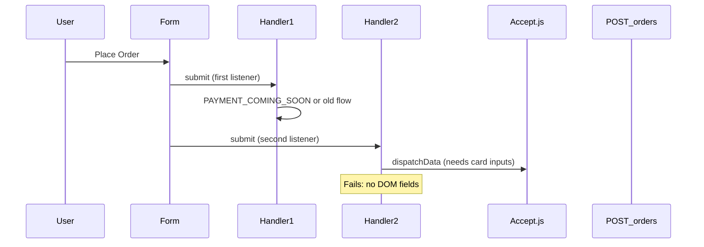

# Checkout payment: fix and test plan

## What went wrong

- **[views/checkout.html](views/checkout.html) has two inline scripts** that both call `addEventListener('submit', ...)` on `#shippingForm` (approximately lines 232 and 773). On Place Order, **both handlers run**. The first block still has `PAYMENT_COMING_SOON = true` and posts **without** payment tokens; the second block expects **Authorize.net Accept.js** and looks for `#cardNumber`, `#expMonth`, `#expYear`, `#cardCode`. Those elements **do not exist** in the form markup (only shipping fields are present), so `tokenizeCardSandbox()` throws: *Payment fields are missing...*
- The integration in code is **Authorize.net** (Accept.js in the browser + opaque data to `[POST /api/shop/orders](routes/shop.js)` ~260–370). **Chase as the merchant bank / processor relationship** does not change this: you still configure and test via **Authorize.net** (sandbox API Login ID, public client key, transaction key) and their sandbox test cards—not a separate Chase developer API in this codebase.

## Implementation steps (recommended order)

### 1. Consolidate to a single checkout script

- Remove the **first** inline `<script>` block (the one ending around line 333 with `init()`), **or** merge its unique bits into one block and delete the duplicate.
- Ensure **only one** `init()` runs and **only one** submit handler is registered for `#shippingForm`.
- Remove `PAYMENT_COMING_SOON` entirely once the Accept.js path is the only path, or set it `false` and delete dead branches so behavior is unambiguous.
- Keep **one** copy of shared helpers: `CART_KEY`, `getCart`, `renderSummary`, `checkAuth`, `updateAuthLink`, `showError`/`hideError`, nav toggle, scroll progress (match existing patterns in [public/js/main.js](public/js/main.js) where appropriate to avoid triple-binding if `main.js` already wires nav).

### 2. Add payment fields to the form (required for Accept.js)

Inside `#shippingForm`, after ZIP (and before `#checkoutError`), add labeled inputs:

- `#cardNumber` — `inputmode="numeric"`, `autocomplete="cc-number"`, `maxlength` appropriate for PAN
- `#expMonth` — month (select 01–12 or text with validation)
- `#expYear` — 4-digit year (select or text)
- `#cardCode` — CVV, `autocomplete="cc-csc"`

Use existing classes (`form-group`, `form-label`, `form-input`) from the same file for consistency. Add a short “Test mode” line only if you want it visible in sandbox (optional).

### 3. UX and copy

- **Hide or remove** the “Online payment coming soon” banner (`#paymentComingSoonBanner`) when payments are enabled, or replace copy with a sandbox-only notice so customers are not told checkout is unavailable.
- Ensure `#paymentDisabledNote` is not shown on the happy path.

### 4. Client credentials (Accept.js)

- The second script already sets `ACCEPT_SANDBOX_API_LOGIN_ID` and `ACCEPT_SANDBOX_CLIENT_KEY`. Confirm these are your **Authorize.net sandbox** “API Login ID” and **public client key** (not the transaction key). If keys were pasted into the repo, treat them as sensitive: prefer **server-rendered placeholders** or build-time env injection so secrets are not committed long-term.

### 5. Server credentials ([routes/shop.js](routes/shop.js))

- `POST /orders` uses `process.env.AUTHORIZE_LOGIN_ID` and `process.env.AUTHORIZE_TRANSACTION_KEY` with `controller.setEnvironment(SANDBOX)` (~302–331).
- For local testing, set these in a `.env` file or your shell to **sandbox** API Login ID and **sandbox** Transaction Key (from the same Authorize.net sandbox account as the client key). Without them, charges fail after tokenization succeeds.

### 6. End-to-end test checklist

- `npm start` → `http://localhost:3000` (not `file://`).
- Log in → add journal subscription to cart → `/shop/checkout`.
- Fill shipping + card fields using **Authorize.net sandbox** test card (from their documentation, e.g. successful Visa sandbox number with future expiry and any CVV).
- Confirm Network: `POST /api/shop/orders` returns 200; order confirmation shows; redirect to `/profile`.
- Confirm subscription side effect: `[shop.js](routes/shop.js)` activates `wellness_journal` when line items include that plan (~373–377).

### 7. Production readiness (later)

- Switch Accept.js URL from `jstest.authorize.net` to `js.authorize.net`, use **live** client key and live API credentials only on the server, and set the transaction controller to **production** mode (separate from current SANDBOX constant).
- Re-verify PCI posture: card data only in Accept.js, server receives opaque data only (already the pattern in `shop.js`).

