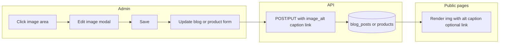

# Click-to-Edit Images with SEO and Optional Links

## Current state

- **Blog posts**: [routes/blog.js](routes/blog.js) and [db/database.js](db/database.js) — `blog_posts` has `image` (URL only). Admin uses a text input + "Upload from computer" in [views/admin.html](views/admin.html); no alt/title/caption/link.
- **Products**: `products` has `image` (URL only). Admin Shop tab uses "Edit image" modal with URL only; no alt/caption/link.
- **Rendering**: Blog list ([views/blog.html](views/blog.html)), blog post ([views/blog-post.html](views/blog-post.html)), shop list and product detail ([views/shop.html](views/shop.html), [views/shop-product.html](views/shop-product.html)) output `` (empty alt). No link wrapper.
- **Logo / hero**: Static files (`/images/logo.svg`, `/images/hero-bg.png`); not in DB. Out of scope for this plan unless you want a separate "Site media" area later.

## 1. Database: image metadata and link

**File:** [db/database.js](db/database.js)

- **blog_posts**: Add columns (migrations after existing `ALTER TABLE` block):
  - `image_alt` TEXT — short title for SEO / accessibility (used as `alt`).
  - `image_caption` TEXT — optional brief description (SEO/caption).
  - `image_link` TEXT — optional URL; when set, the image is wrapped in `<a href="...">` (e.g. link to /blog, /shop, /services or any URL).
- **products**: Add the same three columns: `image_alt`, `image_caption`, `image_link`.

Use `try { db.exec('ALTER TABLE ...'); } catch (_) {}` so existing DBs stay valid.

## 2. API: accept and return new fields

**Blog** — [routes/blog.js](routes/blog.js)

- In all SELECTs that return post data (public list, public single, admin list, admin single), add `p.image_alt`, `p.image_caption`, `p.image_link` to the selected columns and include them in the JSON response.
- In POST (create) and PUT (update), accept optional `image_alt`, `image_caption`, `image_link` from `req.body` and write them to `blog_posts` (INSERT and UPDATE).

**Shop** — [routes/shop.js](routes/shop.js)

- In any SELECT that returns product (list and detail), add `image_alt`, `image_caption`, `image_link` and expose them in the API response.
- In PUT `/products/:id`, accept optional `image_alt`, `image_caption`, `image_link` and update the `products` row.

## 3. Admin: click-to-edit image UX and reusable modal

**File:** [views/admin.html](views/admin.html)

**Reusable “Edit image” modal (single shared modal):**

- Fields: **Image** (upload button + URL input, as today), **Title** (SEO; used as `alt`), **Description/caption** (optional; SEO and display), **Link URL** (optional; e.g. `https://...`, `/blog`, `/shop`, `/services`).
- Buttons: Save, Cancel. On Save, run a callback that updates the in-memory form (blog or product) and optionally the hidden inputs / DOM for the current context.

**Blog (New Post and Edit post):**

- Replace the current “Featured image” block (upload button + URL input only) with a **clickable image area**:
  - If there is an image URL: show a preview thumbnail and a small “Change image” affordance.
  - If no image: show a placeholder box with “Click to add image” (or similar).
- Clicking the area (preview or placeholder) opens the shared **Edit image** modal pre-filled with current image URL, title (image_alt), description (image_caption), link (image_link).
- On Save: update the blog form’s image URL and the new hidden fields (image_alt, image_caption, image_link), close the modal, refresh the preview. Form submit (Create Post / Save changes) already sends image; extend payload to include image_alt, image_caption, image_link.

**Products (Shop tab):**

- In the product edit flow (existing “Edit image” modal or product row): make the **product image** a clickable area (preview or “Click to add image” placeholder). Click opens the same shared **Edit image** modal (or the existing product modal extended with Title, Description, Link).
- Save updates the product’s image, image_alt, image_caption, image_link (via PUT when saving the product).

**Implementation detail:** Either (A) extend the existing product “Edit image” modal to include title, description, link and keep product-specific, or (B) introduce one shared “Image editor” modal used by both blog and products; both approaches are valid. Plan assumes one shared modal for consistency and less duplication.

## 4. Front-end: render alt, caption, and optional link

**Blog:**

- [views/blog.html](views/blog.html) (list): For each post card, use `post.image_alt` (or post title fallback) for `alt`. If `post.image_link` is set, wrap the card image in `<a href="{{ post.image_link }}">`.
- [views/blog-post.html](views/blog-post.html) (single): Featured image: `alt="{{ post.image_alt || post.title }}"`. If `post.image_link` set, wrap the featured image in `<a href="...">`. If `post.image_caption` is set, render a `<figcaption>` (optional, for SEO/accessibility).

**Shop:**

- [views/shop.html](views/shop.html) and [views/shop-product.html](views/shop-product.html): Use `product.image_alt` (or product name fallback) for `alt`. If `product.image_link` is set, wrap the product image in `<a href="...">`. Caption can be shown on product detail page if desired.

**Link behavior:** Use `target="_blank"` and `rel="noopener noreferrer"` only for external URLs (e.g. `href.startsWith('http')`); internal paths like `/blog`, `/shop`, `/services` stay same-tab.

## 5. Scope and out-of-scope

- **In scope:** Blog featured image and product images only. Both get click-to-edit in Admin, SEO title/description (alt + caption), and optional hyperlink (image and/or link to a section like blog, shop, services).
- **Out of scope for this plan:** Nav logo and homepage hero (static files); making them editable would require a “Site media” or “Homepage” settings area and possibly a small `site_settings` or `media` table. Can be a follow-up.
- **“Section” link:** Interpreted as the **image** having an optional link that can point to internal sections (e.g. `/blog`, `/shop`, `/services`) or any URL; no separate “section” entity.

## 6. Flow summary

## 7. Files to touch (checklist)

| Area           | File(s)                                                                                                                                      |
| -------------- | -------------------------------------------------------------------------------------------------------------------------------------------- |
| DB schema      | [db/database.js](db/database.js) — add columns + migrations                                                                                  |
| Blog API       | [routes/blog.js](routes/blog.js) — SELECT/POST/PUT for image_alt, image_caption, image_link                                                  |
| Shop API       | [routes/shop.js](routes/shop.js) — SELECT/PUT and product responses                                                                          |
| Admin UI       | [views/admin.html](views/admin.html) — clickable image areas, shared Edit image modal, form fields and submit payloads for blog and products |
| Blog front-end | [views/blog.html](views/blog.html), [views/blog-post.html](views/blog-post.html) — alt, optional link wrapper, optional figcaption           |
| Shop front-end | [views/shop.html](views/shop.html), [views/shop-product.html](views/shop-product.html) — alt, optional link wrapper, optional caption        |

No new pages or routes are required; the shared modal lives in admin and is opened by existing blog/product edit flows.