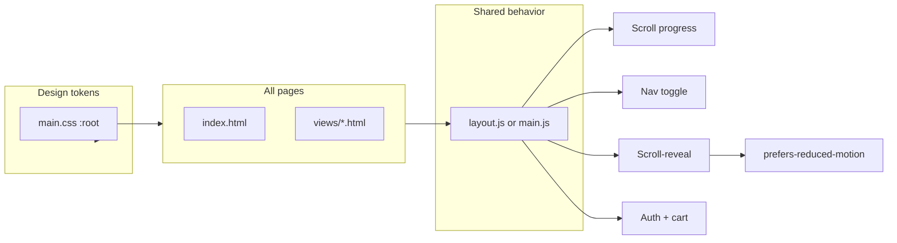

# GUI and Animation Redesign — Plan

## 1. Original prompt (recovered)

The prior agent work came from transcript **[26f424c8-1dc3-4376-ad48-ad246695003b](agent-transcripts/26f424c8-1dc3-4376-ad48-ad246695003b)**.

**User request:** *"i dont like the user interface, make it more modern."*

**Agent response (implemented on homepage):**

- **Typography:** Space Grotesk (headings), Inter (body), JetBrains Mono (stats); tighter letter-spacing and size rhythm.
- **Color and depth:** Near-black backgrounds, layered surfaces, per-section accent palette (later refined to brand: asphalt, safety gold, chrome).
- **Hero:** Animated mesh gradient orbs (parallax on mouse), dot-grid background, animated gradient title text, pulsing badge dot, scroll progress bar, animated stat counters on scroll-into-view.
- **Film grain:** SVG noise overlay site-wide.
- **Cards:** Glass morphism, soft borders, hover lift, per-card accents.
- **Scroll-reveal:** IntersectionObserver-driven reveal with staggered delays for cards/sections.
- **Interactions:** Scroll progress, active nav highlighting, phase tab click/panel animations, parallax hero glows.

A later request added **brand colors** (asphalt black, safety yellow/gold, silver/chrome), logo/header image, and Railway deployment intent; those are already applied in [public/css/main.css](public/css/main.css) and layout.

---

## 2. Current state vs. intended “fully animated” state

| Area | Homepage (index.html + main.js) | Inner pages (About, Services, Blog, Shop, etc.) |
|------|---------------------------------|------------------------------------------------|
| Grain overlay | Yes | Partial (some have it, e.g. About; Blog has no scroll-progress) |
| Scroll progress bar | Yes (JS-driven width) | Missing or static (no main.js) |
| Scroll-reveal | Yes (`.glass-card`, `.hazard-card`, `.rm-card`, etc.) | **No** — inner pages don’t load main.js; no reveal on cards/sections |
| Stat counters | Yes (hero) | N/A |
| Parallax hero glows | Yes | N/A (no hero on inner pages) |
| Nav toggle (mobile) | Yes (main.js) | **Missing** on most views (no main.js) |
| Cart badge / auth navbar | Yes | Inline scripts on some pages only |
| Reduced motion | **Not implemented** | — |

**Additional gaps:**

- **Link hover** in [public/css/main.css](public/css/main.css) line 70: `a:hover { color: #818cf8; }` (purple) — should use brand gold for consistency.
- **Shared behavior:** Scroll progress, nav toggle, and scroll-reveal only run where `main.js` is loaded (index + a few forum pages). Other views use main.css + pages.css but no shared JS.
- **Accessibility:** No `prefers-reduced-motion` handling; animations always run.

---

## 3. Standard SOP for implementing GUI with animations

Apply this as the project standard so any new or updated GUI stays consistent and accessible.

1. **Design tokens (single source of truth)**  
   - Colors, spacing, radii, **easing** (`--ease`, `--ease-out`) and **durations** in `:root` in [public/css/main.css](public/css/main.css).  
   - Use these for all new animations; no ad-hoc timings or colors.

2. **Reduced motion (accessibility)**  
   - Respect `prefers-reduced-motion: reduce` for non-essential motion:  
     - Disable or shorten scroll-reveal, parallax, floating orbs, gradient-shift, pulse, road-line drift, scroll-hint.  
   - Keep essential UI feedback (e.g. focus, tab switch) but use shorter/simpler motion or opacity-only.  
   - Implement via a small utility (e.g. `.reduce-motion` class or media query) and use it in main.css and any page-specific CSS.

3. **Page load / entry**  
   - Optional: subtle fade-in or short stagger for main content on inner pages so they feel consistent with the homepage.  
   - Prefer CSS (opacity/transform) + one shared script that runs on all pages.

4. **Scroll-triggered animations**  
   - Use one shared scroll-reveal mechanism (IntersectionObserver) and a **common set of selectors** (e.g. `.reveal`, `.glass-card`, `.section-header`, `.page-section`) so the same JS works on homepage and inner pages.  
   - Stagger via `data-delay` or index-based delay; keep duration/easing from design tokens.

5. **Micro-interactions**  
   - Buttons, tabs, toggles: same easing and duration (e.g. `0.3s var(--ease)`), hover/active states (e.g. translateY(-2px), border/glow).  
   - Already largely in place; audit any new buttons/links to use gold hover, not purple.

6. **Hero / above-the-fold**  
   - Homepage only: parallax, gradient animation, stat counters. Keep these in CSS + existing main.js; ensure reduced-motion turns off or simplifies them.

7. **Consistency across pages**  
   - Every public-facing page should:  
     - Load the same base layout (grain, scroll-progress bar in HTML).  
     - Load a **shared** script that: updates scroll progress, runs scroll-reveal on the common selectors, wires nav toggle and (where needed) cart/auth.  
   - Inner pages that don’t have hero/stats still get: scroll progress, reveal on sections/cards, nav behavior.

8. **Testing checklist**  
   - Enable “Reduce motion” in OS/browser; confirm no heavy motion, content still readable.  
   - No-JS: content visible and usable (no critical info behind animation-only state).  
   - Same easing/color behavior on homepage and key inner pages (About, Services, Blog, Shop, Contact).

---

## 4. Redesigned implementation plan

**Phase A — Fix and align existing**

- **A1** Fix link hover: in [public/css/main.css](public/css/main.css), change `a:hover { color: #818cf8; }` to use `var(--gold)` or `var(--gold-light)` so it matches the rest of the palette.
- **A2** Add reduced-motion support in [public/css/main.css](public/css/main.css):  
  - `@media (prefers-reduced-motion: reduce)` (and optionally a `.reduce-motion` class) to disable or shorten: float orbs, road-line-drift, gradient-shift, pulse-dot, scroll-hint, scroll-reveal (e.g. make reveal instant or opacity-only), and parallax.  
  - Ensure focus/active states remain clear.

**Phase B — Shared behavior for all pages**

- **B1** Ensure every view that uses the main nav (all public HTML in [views/](views/) and [public/index.html](public/index.html)) includes:  
  - `grain-overlay` div.  
  - `scroll-progress` div with `id="scrollProgress"`.  
  - Script that updates scroll progress (either load shared `main.js` or extract a minimal shared “layout” script).
- **B2** Introduce a **shared layout script** (e.g. `public/js/layout.js` or extend `main.js` to be safe to load on every page):  
  - Scroll progress bar width update.  
  - Nav toggle (mobile menu open/close).  
  - Cart badge and auth-aware nav (fetch `/api/auth/me`, logout).  
  - Scroll-reveal: one IntersectionObserver that observes a **common selector set** (e.g. `.reveal`, `.glass-card`, `.section-header-about`, `.page-section`, `.blog-card`, `.forum-card` — whatever exists on each page).  
  - Run only once on DOMContentLoaded; no duplicate observers when script is included on multiple pages.
- **B3** In every view, add the shared script reference (e.g. `` or ``).  
  - Add class `.reveal` (and where needed `.glass-card` or equivalent) to sections/cards on About, Services, Blog, Shop, Contact, etc., so they get scroll-reveal without changing structure more than necessary.

**Phase C — Consistent animation on inner pages**

- **C1** Add a small “page entry” effect for inner pages (e.g. `.page-shell` or `.page-container` with opacity 0 → 1 and optional short translateY), using CSS + shared script if needed, respecting reduced-motion.
- **C2** In [public/css/pages.css](public/css/pages.css), ensure cards and section headers use the same transition/easing as homepage (e.g. `transition: opacity 0.7s var(--ease-out), transform 0.7s var(--ease-out)` for `.reveal.visible`), and that pages.css doesn’t override with conflicting animations. Reuse or mirror the `.reveal` / `.visible` rules from main.css so one shared script works everywhere.

**Phase D — Documentation and regression**

- **D1** Add a short **GUI/animations SOP** doc (e.g. `.cursor/rules/gui-animations.mdc` or `docs/GUI-ANIMATIONS.md`) that:  
  - References the design tokens in main.css.  
  - Lists the SOP steps above (tokens, reduced-motion, entry, scroll-reveal, micro-interactions, hero, consistency, testing).  
  - States that new pages must include grain, scroll-progress, and the shared script, and use `.reveal` (or the agreed selector) for any section/card that should scroll-reveal.
- **D2** Quick audit: open Home, About, Services, Blog, Shop, Contact — confirm scroll bar, nav toggle, and scroll-reveal (and optional page entry) work; confirm reduced-motion disables heavy motion.

---

## 5. Architecture (high level)

---

## 6. Files to touch (summary)

| File | Change |
|------|--------|
| [public/css/main.css](public/css/main.css) | Fix `a:hover` to gold; add `prefers-reduced-motion` (and optional `.reduce-motion`) to disable/shorten animations. |
| [public/js/main.js](public/js/main.js) | Generalize: ensure scroll-reveal selector set includes classes used on inner pages; optionally split into `layout.js` (scroll, nav, auth, cart, reveal) and keep homepage-only logic (stats, phase tabs, parallax) in main.js or behind a guard (e.g. only run if `#hero` exists). |
| [public/css/pages.css](public/css/pages.css) | Ensure `.reveal`/`.visible` behavior is consistent (or import from main); add page-entry animation if desired; respect reduced-motion. |
| [views/*.html](views/) | Add `scroll-progress` where missing; include shared script; add `.reveal` (and/or shared class) to key sections/cards. |
| [public/index.html](public/index.html) | Already has script; ensure it stays compatible with shared behavior (e.g. if split, load both or one combined). |
| New: `.cursor/rules/gui-animations.mdc` or `docs/GUI-ANIMATIONS.md` | Document the SOP and “how to add a new page” for animations. |

---

## 7. Success criteria

- **Original prompt satisfied:** Modern UI with glass morphism, grain, animated hero, scroll-reveal, and brand colors is in place; this plan extends that to the **whole site** and makes it **consistent and maintainable**.
- **SOP in place:** One documented standard (tokens, reduced-motion, entry, scroll-reveal, micro-interactions, consistency, testing) for any new or updated GUI.
- **Properly animated:** Homepage and all key inner pages have: scroll progress, scroll-reveal on sections/cards, working nav (including mobile), and consistent link/button hover (gold). Optional: light page-entry animation on inner pages.
- **Accessibility:** `prefers-reduced-motion: reduce` disables or significantly reduces non-essential motion.
- **No regression:** Existing homepage behavior (parallax, stat counters, phase tabs, checklists) remains; inner pages gain behavior without breaking current styling.
