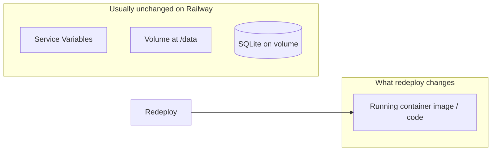

# Railway state, payments, and recovery plan

## User decisions — recorded (answers you saved)

Use this as the source of truth for future builds. Small notes from the assistant are in *italics*.

### B — Wellness journal, kit, deck

| # | Decision |
|---|----------|
| **4** | **Subscription journal:** Offer **one month at a time** aligned to the **current calendar month** (matches subscription purpose). *Later:* if you add **prepaid lengths** (30 / 60 / 90 / 120 / 365 days) at checkout, extend **download access and perks** for that paid window. *This is a larger change: new checkout/SKU or subscription billing rules + entitlement storage.* |
| **5** | **Mile 12 Warrior Kit:** **12‑month downloadable PDF-style journal**, **dated from the purchase month** (accurate months). **No physical journal** for now. **Quick-reset deck:** **downloadable**; **permanent** access on a **dedicated page** after purchase with **CB handle** at top; **admin** gets a **master reference copy**; you may add **physical deck** to ship later. **Everything else in the kit** ships **physically** to the checkout address (**dropship**). |
| **6** | **Single-owner / renewal** positioning: **confirmed.** |

### C — Order tracking

| # | Decision |
|---|----------|
| **7** | Customer-facing stages **Paid → Processing → In transit → Delivered**. Use **“In transit”** (not only “Shipped”) so it’s accurate when **no tracking** exists — avoids implying every package is trackable. |
| **8** | **Admin** still records **optional tracking** when the carrier provides it, for your own follow-up; show **“Track package”** (or the number) to the customer **only when** a tracking value exists. |
| *Note* | *Aligned with C7: “In transit” is the default middle stage; tracking is optional enhancement.* |
| **9** | **Internal notes** on orders: **yes.** |

### D — Vendors / inventory

| # | Decision |
|---|----------|
| **10** | **All physical** fulfillment: **dropship from vendor** for now. |
| **11** | **Phase 1:** spreadsheet + current **`stock`** is OK. **Phase 2:** DB/admin vendor fields **yes**, with **free-text vendor** until data is final. |

### E — Feedback / email

| # | Decision |
|---|----------|
| **12** | Quick survey: **skip for now.** |
| **13** | **Yes:** contact form should also **email** **admin@mile12warrior.com** (when SMTP is configured), not only save to DB. |

### F — Post-purchase priority

| # | Decision |
|---|----------|
| **14** | **Receipt email + receipt page together** (same delivery). |
| **15** | Profile **v1** priority: **receipt link** (then expand to full “digital access” hub later). |

### G — QR & admin blog

| # | Decision |
|---|----------|
| **16** | QR resolves to **`/login`** so scanners land on a **secure entry point**; session stays on their device. *Reasonable; homepage QR is an alternative if you want anonymous visitors to browse first.* |
| **17** | **Admin blog modal** plan: **not a priority** (todo cancelled). |

---

## What we can and cannot see from the repo

- **Cannot see:** Which Railway deployment is currently serving traffic, build logs, or whether you clicked “redeploy” on an old **deployment** vs a normal **auto-deploy from `main`**. That lives only in the [Railway dashboard](https://railway.com) (Deployments tab, each deploy shows commit SHA / message).
- **Can see:** Your **intended** production code is on GitHub `main`. Locally, `main` is aligned with `origin/main`; recent history is heavily payment-related, ending with credential-handling fixes:
  - `c1d27b5` — Authorize.net: strip quoted secrets; log credential lengths on API auth failure  
  - Earlier chain: `payment-config` API, Accept.js checkout, `POST /api/shop/orders`, orders payment columns, SDK timeout fixes, etc.

So if Railway is running an **older commit**, you may have lost those fixes on the server even though your **GitHub repo is still good**.

## What an accidental “bad” redeploy usually does (and does not do)

- **Typically persists:** Environment variables (`AUTHORIZE_*`, `DB_PATH`, `SESSION_SECRET`, etc.) and the **volume** at `/data` (your SQLite file), per [RAILWAY.md](RAILWAY.md). Redeploying does not wipe those unless you changed settings.
- **Changes:** The **application code** in the running container. If that code is from an old deploy, you might see: missing routes, old checkout behavior, startup errors if schema expectations drifted (migrations in [db/database.js](db/database.js) run on boot—very old code might behave differently).

**Damage assessment:** Compare **live commit** to **GitHub `main`**. No commit change → no code regression. Old commit → possible broken checkout, missing logging fixes, or startup issues—not automatic data loss from redeploy alone.

## Reading GitHub: commit `c1d27b5` and the red lines

**Red and green on a commit page are normal.** GitHub shows a **diff** (a before/after):

- **Red (with a minus `-`):** code that was **removed** in this commit. It is *not* an error or “bad line” in the final app.
- **Green (with a plus `+`):** code that was **added**.

So when you see both an old `return String(raw)...trim();` in red and a new `let s = String(raw)...` block in green, GitHub is showing **the swap**: the old one-line return was **replaced** by the longer function that also strips wrapping quotes. If you read them as one block, it looks broken—that is only the **two versions stacked** for comparison. The **actual file** has a single correct function.

**What `c1d27b5` improved (plain English):**

1. **envAuthorizeCredential** — Still strips BOM and whitespace; **now also** removes a leading/trailing `"` or `'` if someone pasted secrets from Railway with quotes. That avoids Authorize.net rejecting logins for a dumb formatting reason.
2. **router.post('/orders') logging** — Adds `credentialMeta: { loginIdLen, transactionKeyLen }` on some failure paths so support logs can see “did the keys load at full length?” without printing the secrets.

**If GitHub shows a “failure” next to the commit:** that is usually a **separate status** (CI check, deploy hook, etc.). This repo has **no** `.github/workflows` in the workspace snapshot—so any X might be from **Railway**, **Vercel**, or another connected app. Click the failed check to read the **exact error message**; that message is what matters, not the red diff lines.

## Railway build error you found (the important line)

Your log’s real failure is:

`ERROR: failed to build: failed to solve: secret AUTHORIZE_PUBLIC_CLIENT_KEY: not found`

**What it means:** Railway is running a **Docker-style build** (BuildKit). Something in that build references a **build secret** named exactly `AUTHORIZE_PUBLIC_CLIENT_KEY`. During `docker build`, that secret must be supplied; Railway did not find it, so the **build** stopped. That is **not** the same as “runtime env var missing when the app runs”—it fails **before** the app starts.

The other JSON lines (`No package manager inferred`, `install apt packages: libatomic1`) are often normal build steps that Railway still labels with high severity; **ignore them** unless they appear alone without the `failed to solve: secret` line.

**What to do (pick the path that matches your Railway setup):**

1. **If you use a Dockerfile (on Railway or in the repo):** Open it and search for `secret`, `AUTHORIZE_PUBLIC_CLIENT_KEY`, or `--mount=type=secret`. If the Dockerfile injects that key at **build** time, you must define the same name in Railway as a variable that is **available at build** (Railway’s UI often has a “build-time” or similar toggle for variables), **or** remove that build step so keys are only read at **runtime** (normal for this Node app: `npm install` / `npm start` does not need Authorize keys in the Dockerfile).
2. **If you do not intend to use build secrets:** In Railway → service **Settings**, check **build / Docker** configuration. Switch to **Nixpacks** (or Railway’s default Node builder) without a custom Dockerfile that mounts secrets, **or** delete the Dockerfile reference if it was added by mistake. The website repo snapshot has **no** `Dockerfile`; if Railway still uses Docker, the Dockerfile may live only in the dashboard or another branch—find and align it with the two options above.
3. **After the build succeeds:** Keep `AUTHORIZE_PUBLIC_CLIENT_KEY` (and the other `AUTHORIZE_*` vars) in **Variables** for **runtime** so `/api/shop/payment-config` and checkout work.

The first two JSON lines are noise relative to the `**secret … not found`** line—that one is the blocker.

## Step 1 — Establish truth in Railway (5–10 minutes)

1. Open your Railway project → **Deployments**.
2. Note the **currently active** deployment: **commit SHA** and message (should match GitHub).
3. Compare to GitHub `main` HEAD (e.g. open your repo on GitHub and check latest commit on `main`; locally it was `c1d27b5` at snapshot time).
4. **If they differ:** Use Railway’s option to **deploy from the latest `main`** (or redeploy the deployment that matches current `main`), not an arbitrary older row in the list.
5. Confirm **Settings → Volumes**: mount still `/data` and **Variables**: `DB_PATH=/data/drivershield.db` (and other vars unchanged).

## Step 2 — Verify payments end-to-end (Authorize.net)

Implementation is already in the codebase:

- **Config endpoint:** `[GET /api/shop/payment-config](routes/shop.js)` — returns `configured`, `mode`, Accept.js URL, public keys (no secrets).
- **Charge + order:** `[POST /api/shop/orders](routes/shop.js)` — Accept.js opaque data → Authorize.net `AUTHCAPTURETRANSACTION` → order rows + `payment_status`, `transaction_id`, grants.

**Production checks (after you know the live commit is correct):**

| Check            | Action                                                                                                                                                                                                                                             |
| ---------------- | -------------------------------------------------------------------------------------------------------------------------------------------------------------------------------------------------------------------------------------------------- |
| Config           | Open `https://mile12warrior.com/api/shop/payment-config` (or your Railway URL). Expect `configured: true` if `AUTHORIZE_LOGIN_ID` and `AUTHORIZE_PUBLIC_CLIENT_KEY` are set; `mode` matches sandbox vs live intent.                                |
| Env completeness | In Railway Variables: `AUTHORIZE_LOGIN_ID`, `AUTHORIZE_TRANSACTION_KEY`, `AUTHORIZE_PUBLIC_CLIENT_KEY`, and `AUTHORIZE_USE_PRODUCTION` (`0` sandbox / `1` live). See [docs/PAYMENTS-AUTHORIZE-NET-SETUP.md](docs/PAYMENTS-AUTHORIZE-NET-SETUP.md). |
| Logs             | After a test checkout, Railway **Logs** for `[authorize.net]` / payment failure JSON (recent commits added structured logging for credential and API issues).                                                                                      |
| Sandbox vs prod  | Mismatch (e.g. prod keys + sandbox flag) is a common “broken along the way” cause—align all three credentials and `AUTHORIZE_USE_PRODUCTION`.                                                                                                      |

**Local parity:** Run `npm start`, set the same vars in `.env` (non-production), hit `/api/shop/payment-config` and run one sandbox checkout.

## Step 3 — Fix anything actually broken

- **If live commit was wrong:** Redeploy latest `main` (Step 1); retest Step 2.
- **If `payment-config` shows `configured: false`:** Fix missing vars or BOM/quotes (code strips quotes—see `envAuthorizeCredential` in [routes/shop.js](routes/shop.js)); redeploy if needed.
- **If charges fail with 400/500:** Use logs + Authorize.net Merchant Interface; map to decline vs transport error (existing `logAuthorizePaymentFailure` paths).
- **If app crashes on startup:** Check deploy logs for SQLite/migration errors; confirm volume + `DB_PATH`.

## Step 4 — “Plan we were building” for the website (from repo artifacts)

- **Payments doc vs code:** [docs/PAYMENTS-AUTHORIZE-NET-SETUP.md](docs/PAYMENTS-AUTHORIZE-NET-SETUP.md) still has a “what we will add” table that reads like a future plan, but **card checkout is largely implemented** (checkout + API). Remaining product work that shows in the repo:
  - **Copy:** [views/shop.html](views/shop.html) and [views/cart.html](views/cart.html) now describe **live secure checkout** (aligned with Authorize.net when env vars are set).
  - **Optional next features** (from the same doc): Apple Pay / Google Pay, PayPal separately.
- **Cursor plan file:** [.cursor/plans/admin-blog-modal-fix.md](.cursor/plans/admin-blog-modal-fix.md) is **only** about admin blog modal (close/drag/resize, New Post)—**not** payments. Treat that as a separate backlog item if you still want it.
- **Go-live doc:** [docs/GO-LIVE-STEP-BY-STEP.md](docs/GO-LIVE-STEP-BY-STEP.md) Part E and the payments section were refreshed for **Authorize.net** and `/api/shop/payment-config`.

## Step 5 — Post-purchase email (link to purchaser)

**Requirement:** Send an email to the **purchaser** after a successful paid order, including a **link** they can open later (receipt / order summary).

**Implementation outline (when executing):**

1. **Trigger:** In `[routes/shop.js](routes/shop.js)`, inside the successful path of `POST /api/shop/orders` (after the DB transaction commits and before `res.json`), call a small mail helper. Use the logged-in user’s **email** from `req.session.user` (or a DB lookup by `user_id` if email is not on the session).
2. **Transport:** Reuse the same pattern as `[routes/auth.js](routes/shop.js)` `sendPasswordResetEmail`: `SMTP_HOST`, `SMTP_USER`, `SMTP_PASS`, `SMTP_PORT`, `FROM_EMAIL`. If SMTP is not configured, **log** and **do not fail** the order (same philosophy as password reset).
3. **nodemailer:** Add to `[package.json](package.json)` dependencies if it is not already declared (auth uses `require('nodemailer')` optionally today).
4. **Link target:** Build an absolute URL with `process.env.BASE_URL` or derive from the request (`req.protocol` + host), per [RAILWAY.md](RAILWAY.md). Recommended paths:
  - `/profile?order=<id>` — profile scrolls/highlights that order once `[views/profile.html](views/profile.html)` supports it, or
  - `/shop/order/<id>` — dedicated receipt page (session must match `orders.user_id`; add `GET` route + API `GET /api/shop/orders/:id` returning line items, shipping, `paid_at`, `transaction_id` for the owner only).
5. **Email content:** Subject e.g. “Mile 12 Warrior — Order #123 confirmed”. Body: short thank-you, order total, last line items (names), and a single **button/link**: “View your order” → the URL above. Optional plain-text duplicate.
6. **Railway:** Ensure `BASE_URL=https://mile12warrior.com` (or your canonical host) so links in email are correct behind proxies.

**Depends on:** A stable **receipt destination** (todo `post-purchase-receipt-ui`) so the link is not a dead end; implement receipt API/page first or in the same change as the email.

## Step 6 — Product: wellness journal, kit PDFs, Mile 12 reset deck

These are **content and merchandising** decisions on your side, plus **site behavior** when you are ready to implement.

**What already exists in the codebase (for context):**

- **Mile 12 Warrior Kit** (`mile-12-warrior-kit`, category `kits`, $49.99) — treated as **physical / kit** today; it does **not** auto-create `product_access_grants` (only `category === 'digital'` products do).
- **Trucker Wellness Journal** — standalone product and **monthly subscription** (`trucker-wellness-journal-monthly`) with forum/journal perks in app logic.
- **Digital downloads** for packets/course use **grants** + `/api/shop/packet-access` and related routes in `[routes/shop.js](routes/shop.js)`.

**Paths you described (you can mix them):**

| Direction                             | Your work (assets / ops)                                      | Site work (when implementing)                                                                                                                                                                            |
| ------------------------------------- | ------------------------------------------------------------- | -------------------------------------------------------------------------------------------------------------------------------------------------------------------------------------------------------- |
| **Wellness journal (new or refined)** | Final PDF or print design, branding, page structure           | Host file(s), optional **purchase-gated** download; if bundled with kit, extend `DIGITAL_GRANT_MAP` for `mile-12-warrior-kit` (or add a “kit digital bundle” map) so buyers get download links after pay |
| **Kit journal as editable PDF**       | Export PDF (fillable fields optional); version files (v1, v2) | Store under e.g. `public/downloads/` *or* protected route that checks grant/order; link from **profile “My downloads”** + confirmation email                                                             |
| **Physical journal**                  | Printing, inventory, packaging, shipping workflow             | Keep as **physical** line item; improve **order status** copy (`processing` / `shipped`) and receipt email so customers know **mail** timeline; stock in `products.stock`                                |
| **Mile 12 reset card deck**           | Card content, print spec, SKU decision (standalone vs in kit) | New **product** row (or bundle); if digital-only PDF, same grant/download pattern as journal                                                                                                             |

**Recommendation (sequencing):**

1. Decide **what is in the kit** vs sold separately (journal PDF only in kit, or also sold alone; deck in kit or add-on).
2. Produce **final PDFs** (and print proofs for physical items) before wiring downloads—URLs and filenames stay stable.
3. Then implement **grants or order-scoped download tokens** for kit buyers so the “everything disappeared” problem goes away for digital pieces.

**Regulatory note:** Journal/wellness copy should stay **educational**, not medical advice; site disclaimer rules in workspace still apply.

## Step 7 — Physical products: inventory + vendor / dropship checklist (backend)

**Goal:** A **full checklist** you can use operationally now, and later mirror in the **admin backend** so every physical SKU tracks stock, vendors, and who ships.

### A. Per-SKU checklist (use in a spreadsheet until the DB supports it)

Repeat for each physical product (e.g. T-shirt, vest, kit, printed journal, card deck):

**Product identity**

- Internal name + **slug** (matches `products.slug` in the shop)
- Sell price vs **target landed cost** (your margin)
- **SKU / variant** notes (size, color) if you add variants later

**Inventory (today: `products.stock` in [db/database.js](c:\Projects\Website\db\database.js))**

- Opening **on-hand** count synced to admin
- **Reserved** rule (optional): subtract only when order ships vs at payment—decide policy
- **Reorder point** (alert when stock ≤ X)
- **Safety stock** / lead time in days (how early to reorder)

**Vendor / print shop (for ordering more units)**

- **Vendor name** + primary contact (email/phone)
- **Vendor portal URL** (where you log in to order)
- **Vendor’s SKU / product ID** for this item
- **Quote or price sheet** date + unit cost + minimum order qty (MOQ)
- **Turnaround** (production + shipping to you, or direct-to-customer)
- **Print / product spec** location (PDF, Canva link, or `public/…` path)
- **Proof approval** done? (yes + date)

**Fulfillment model**

- **Ship yourself** (inventory in your garage/office) vs **dropship / print-on-demand** (vendor ships to customer)
- If dropship: **does vendor offer blind / white-label ship?** Address format for “ship to customer”
- **Packing slip / branding** requirements (insert card, logo on box)

**Quality & compliance (physical goods)**

- Sample received and approved
- Apparel: fiber content / care label if required for your sales channel
- Any **CA Prop 65** or product-specific notices (if applicable to that SKU)

**After launch**

- Last **restock date** + quantity ordered
- Link to **invoice** or PO (Drive folder is fine)

### B. What the backend has today vs gaps

- **Today:** `products` has `**stock`**, `**category`**, admin **Shop** tab lists products with stock; checkout **decrements stock** on paid order (`[routes/shop.js](c:\Projects\Website\routes\shop.js)`).
- **Gaps:** No fields for **vendor**, **reorder threshold**, **fulfillment type**, **vendor SKU**, **internal notes**, or **print-spec link**. Admin **edit** is mostly **image** today—not a full physical-SKU ops form.

### C. When you implement in code (todo `admin-physical-vendor-fields`)

1. **SQLite migration** (in `database.js`): add nullable columns on `products` (or a `product_fulfillment` side table) e.g. `fulfillment_type` (`self` | `dropship` | `pod`), `vendor_name`, `vendor_url`, `vendor_sku`, `reorder_point`, `cost_notes` (TEXT), `internal_notes` (TEXT), `print_spec_url` (TEXT).
2. **Admin UI:** extend product table + edit form to view/edit these fields for **physical** categories only (`apparel`, `kits`, `accessories`, etc.).
3. **Optional:** admin **“low stock”** filter where `stock <= reorder_point` (and `reorder_point IS NOT NULL`).
4. **Optional:** export CSV of physical SKUs for your own purchasing runs.

**Dropship note:** The site will **not** auto-place orders at Printful/SPOD/etc. without their API—you still **click to order** at the vendor; the backend gives you one place to see **who**, **what SKU**, and **when to reorder**.

## Step 8 — Wellness journal: what exists today vs your PDF / 12-month vision

**What we actually built (verified in repo):**

- The shop route `**/shop/product/trucker-wellness-journal`** **redirects** to `**trucker-wellness-journal-monthly`** (`[server.js](c:\Projects\Website\server.js)`) — the primary offer is the **monthly subscription**, not a one-time book.
- **Subscribers** get the **online** journal (`[/journal](c:\Projects\Website\views\journal.html)`) and a **print/download** page (`[/journal/print](c:\Projects\Website\views\journal-print.html)`) with a **generic weekly template** (repeated blocks). Users **print or Save as PDF** from the browser. It is **not** a **purchase-dated 12-month run** (no calendar from “purchase date → +1 year”), and it is **not** a personalized PDF generated per user.
- Access is gated by **active subscription** (`[routes/journal.js](c:\Projects\Website\routes\journal.js)`), **not** by `product_access_grants` for a one-off digital SKU (`DIGITAL_GRANT_MAP` in `[routes/shop.js](c:\Projects\Website\routes\shop.js)` has **no** wellness-journal slug).
- A **standalone** “Trucker Wellness Journal” product still exists in seed data as **accessories** / $14.99 (`[db/database.js](c:\Projects\Website\db\database.js)`), but shoppers hitting the old slug are steered to **subscription**.
- **Physical** journal **mailing** as its own fulfillment workflow is **not** modeled in code (no ship queue beyond generic `orders.status`).

**Conclusion:** You do **not** yet have a **single-purchase, 12-month dated PDF** (purchase → anniversary) with **one-owner** semantics and **renewal messaging**. That is **new product + engineering** work. The **subscription** path is **monthly recurring**, not “one payment = 12 months PDF.”

**Your stated goals (for implementation later):**

- **PDF-style 12-month journal** with **dates from purchase through one year**, **single license / one owner**, copy that **encourages repurchase** after the year.
- **Profile:** a clear place (tab or section under purchases) for **“Wellness journal PDF”** (or “My downloads”) when entitled — link only while license valid.
- **Optional product split:** keep subscription for web perks; **add** a separate one-time **12-month PDF product** (or bundle) with `expires_at` on a grant, **or** change subscription positioning — **product decision**.

## Step 9 — Order progress (customer) + fulfillment pipeline (admin)

**Customer-facing “tracker”:**

- Today, profile shows **My Orders** with **Paid** + `**pending`** fulfillment (`[views/profile.html](c:\Projects\Website\views\profile.html)`); there is **no** shipped date, **no** tracking number, **no** stepper UI.
- **Needed:** extend `orders` (or related table) with fulfillment stages: `paid` → `processing` → `in_transit` → `delivered`, with customer-facing label **In transit** (works with or without carrier tracking), plus optional `tracking_number`, `shipped_at`. Expose via `GET /api/shop/orders` and render a **simple timeline** on profile or order receipt page; show **Track package** only when `tracking_number` is set.

**Admin / operations:**

- **Needed:** admin list/detail for orders with **actions** or dropdown to move stage through **paid / processing / in transit / delivered**, with **optional** carrier + tracking when available. Optional **internal note** (“vendor PO sent”, “backordered”).
- Tie-in to **Step 7** vendor fields when the same person updates stock and vendor POs.

**Todos:** `wellness-pdf-12-month-license`, `order-fulfillment-tracking`

## Step 10 — QR codes (site-wide + admin “print kit”)

**How QR codes work (standard practice):**

- A QR code encodes **one main payload**. Most often that is a **URL** (e.g. `https://mile12warrior.com`). Scanning opens the browser to that page.
- It does **not** automatically embed your full **contact block** (phone, email, address) unless you use a **different** format (e.g. **vCard** / `mailto:` / `tel:` — limited length, and vCard QRs are for “save contact,” not always ideal for marketing).
- **Typical print design** for flyers, cards, and billboards: **one QR** pointing to the **homepage** or a **dedicated landing URL** (e.g. `/contact` or `/?src=qr-card`), plus **printed text** next to it for **phone, email, and address** — because people expect to read those without scanning, and QR alone is not a substitute for legal/trust copy on static ads.

**Your goals mapped:**

| Goal                                               | Approach                                                                                                                                                                                                                         |
| -------------------------------------------------- | -------------------------------------------------------------------------------------------------------------------------------------------------------------------------------------------------------------------------------- |
| **Users — easy return to the site**                | Footer or account area: QR that resolves to `**BASE_URL`** (same canonical domain as production). Optional: `?src=footer` for analytics.                                                                                         |
| **Admin — advertising, flyers, cards, billboards** | **Admin-only page** (or tab) that generates **downloadable PNG/SVG** QR images for agreed URLs, with **copy-paste** of the exact URL and short **print guidelines** (minimum size, contrast).                                    |
| **Website + contact in one scan**                  | Prefer **QR → homepage or `/contact`**, and keep **phone/email printed** on the card. Alternatively: **two** QRs on large layouts (site vs `mailto:`) — usually cluttered on a business card; **one URL QR + text** is standard. |

**Implementation outline (when executing):**

1. **Canonical URL:** Use `process.env.BASE_URL` or `https://mile12warrior.com` for production QR generation so scans always match live DNS.
2. **Library:** Add something like `qrcode` (Node) or client-side `qrcode` (browser) to render SVG/PNG; admin downloads **high-res PNG** for print.
3. **Public site:** Optional **small “Scan to visit”** block in **footer** or **mobile menu** (hidden on tiny screens if redundant — product call).
4. **Admin:** Section **“Marketing QR”** with: URL field (default homepage), **Generate**, **Download PNG/SVG**, optional **UTM** (`?utm_source=flyer&utm_medium=print`).
5. **Accessibility:** Decorative QR with `alt` text; never the only way to reach critical info.

**Todo:** `qr-site-and-admin-print-kit`

## Suggested order of work after you confirm Railway

1. Align Railway active deployment with GitHub `main`.
2. Hit `/api/shop/payment-config` and one sandbox (or small live) transaction.
3. Update shop/cart (and optionally GO-LIVE doc) so public copy matches real checkout.
4. Post-purchase: receipt API/page + **order confirmation email with link** (Step 5).
5. Profile: “My digital access” (grants, expiry, downloads) and `orders.status` after pay — see prior discussion on kit vs digital grants.
6. **Step 6:** Finalize kit/journal/deck product mix and assets; then wire PDF downloads + grants for kit if needed.
7. **Step 7:** Run the **per-SKU checklist** in a sheet; when ready, add **vendor + reorder** fields and admin UI (`admin-physical-vendor-fields`).
8. **Step 8–9:** Decide **subscription vs one-time 12-month PDF**; implement **dated PDF + profile download** + **order tracking + admin fulfillment stages**.
9. **Step 10:** QR for **site return** + **admin print-ready** assets for flyers/cards/billboards (`qr-site-and-admin-print-kit`).
10. Optionally implement [admin-blog-modal-fix](.cursor/plans/admin-blog-modal-fix.md) if that remains a priority.

Plan updates are documentation only until you ask to implement.